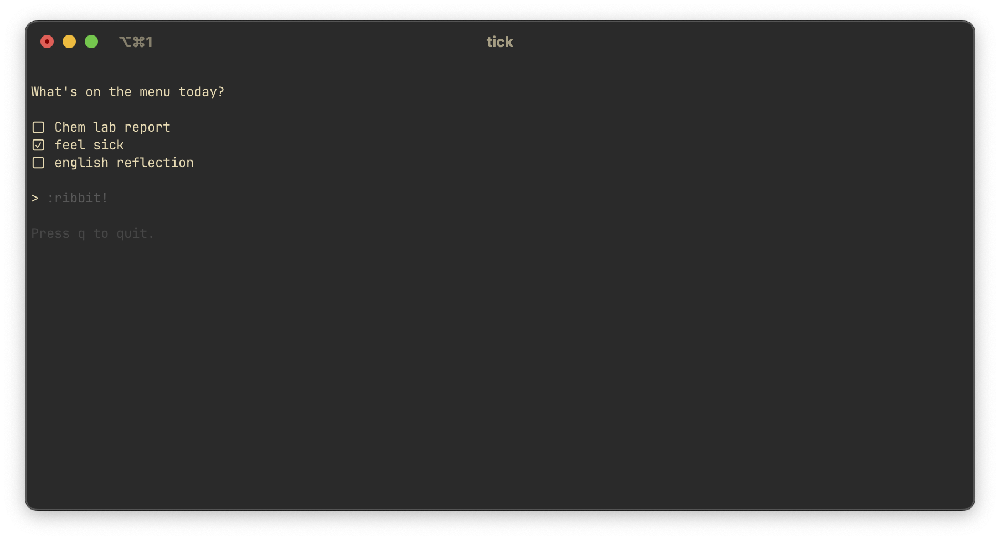

# Ticky

A simple, straightforward checklist 




## Installation

Download the program to your desired directory
```
git clone https://github.com/poincare-lang/Ticky.git
```

Build the program
```
cd Ticky
```
followed by 
```
go build tick
```

Run the executable
```
./tick
```

## Usage

To add a task, use the :add command. To undo deleting a task, use the :undo command

